# School_District_Analysis

## Overview

Maria was asked by the school board to put together an analysis of the school district to help make future funding decisions. This included an analysis of any trends by grade level, budget spent, school size, and school type across all of the schools in the district. Maria enlisted our help to perform this initial analysis for the district, but then a suspected case of academic dishonesty came up in one of the school's 9th grade classes. Because of this, we had to revisit our analysis and account for the student's whose scores were invalidated.

## Results

### District Summary

Overall, the district summary did not see much of an impact with the removal of the 9th grade class from Thomas High School's student's grades from the analysis. 

#### District Summary - Original Results
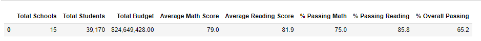

#### District Summary - Updated Results
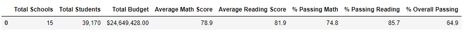

Initially, the original results were rounded to a whole number, but I've brought it out to one decimal place for comparison's sake. We then see the following differences at the district level when the Thomas High School ninth grade scores are removed:
  - Average Math Score down .1 %
  - Average Reading Score no change
  - % Passing Math down .2 %
  - % Passing Reading down .1 %
  - % Overall Passing down .3 %

These aren't huge differences when looking at the whole district, but there is a negative trend when the THS 9th grade is removed.

### School Summary

In the first look at the by school level summary, the scores for THS are very low. This is because at this point in the code, the scores had been invalidated and replaced with NaN, but had not yet been removed from the calculations. This means they were essentially counted as zeroes, because they added no score to the summation, but added a student count to the total, bringing the average down.

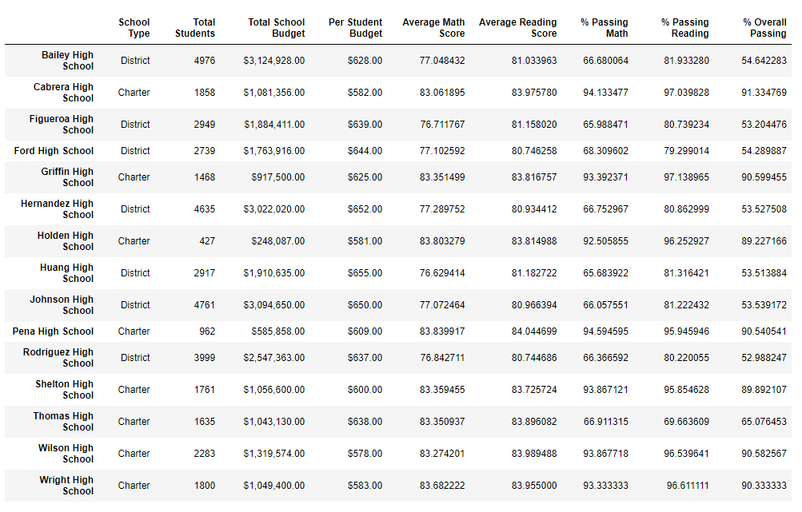

Instead, if we compare the school summaries to before the grades are invalidated, we see the following two images, first being with the invalidated but not zeroed out grades, second with the THS 9th graders removed completely. As you can see, the change is less overall when viewed in this way.

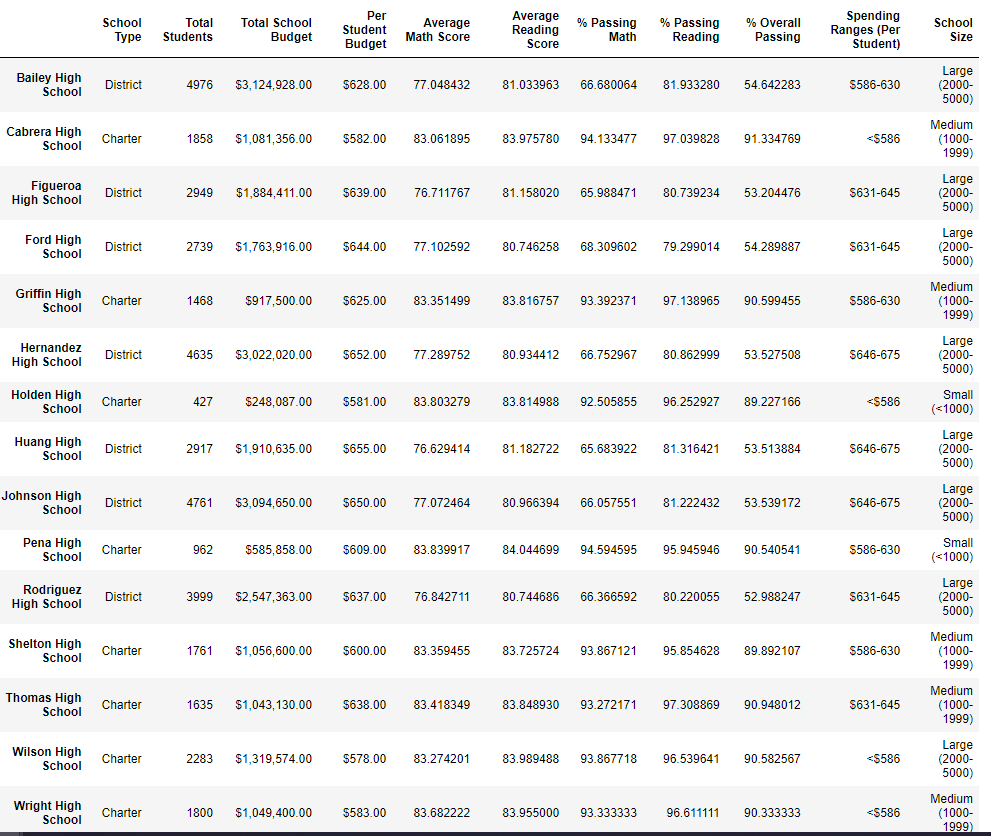

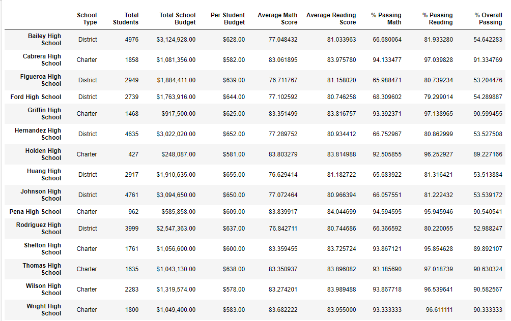

For the remainder of the results, we will compare the THS scores from before they were invalidated, to after the THS 9th graders were removed.

### Relative Position

THS Dropped in overall passing % rate when the 9th graders are removed, but their ranking relatively amongst other schools stayed the same.

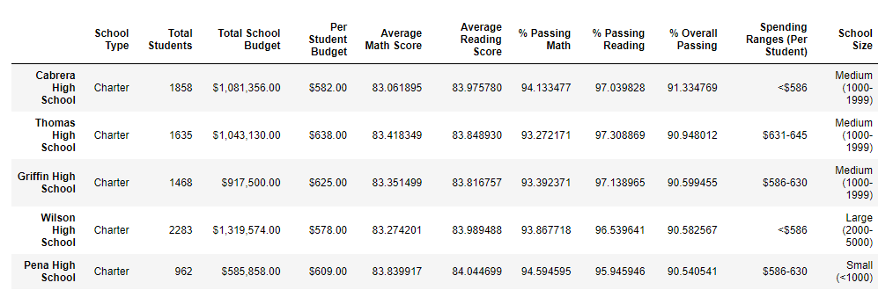
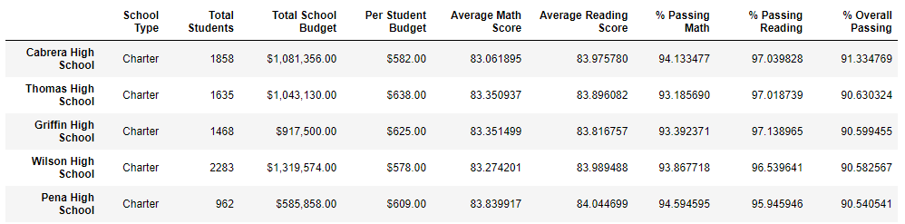

### Other Metrics

In both the math and reading scores by grade, there were no changes to any categories besides the 9th graders at Thomas High School, who now have NaN in the updated scores due to them all being invalidated.

#### Math Scores by Grade
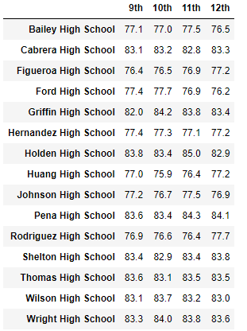                   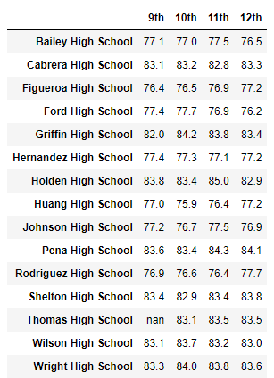

#### Reading Scores by Grade
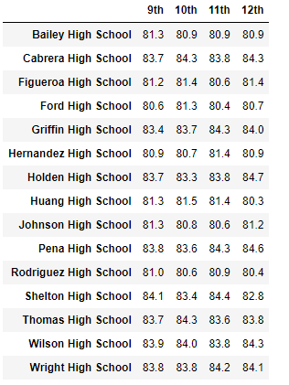                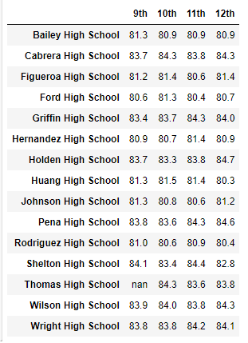

When you take a look at the scores by spending, by school size, and by school type, there are no changes seen at all when rounded to the level requested by Maria and the school district.

#### Scores by School Spending per Student
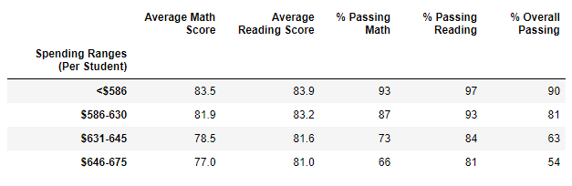       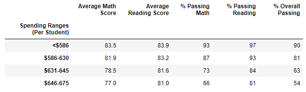

#### Scores by School Size
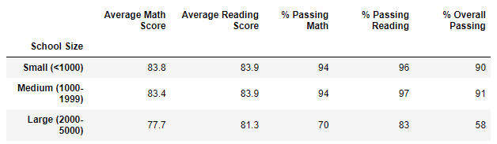            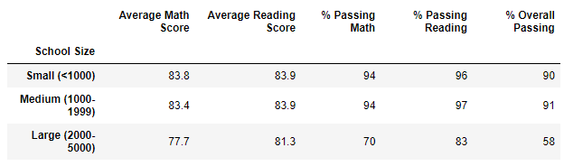

#### Scores by School Type
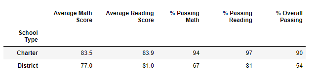            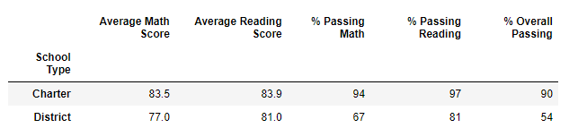

### Summary 
Overall, at the district level the academic dishonesty in the 9th grade class at Thomas High School caused next to no changes when considering the scores by the larger metrics. At the school level, Thomas stayed the same rank compared to other schools, but did drop in overall passing rate, drop in math passing rate, and drop in reading passing rate. If we leave zeroes rather than nulls in the scoring, then Thomas's overall passing rate plummets. 

    
